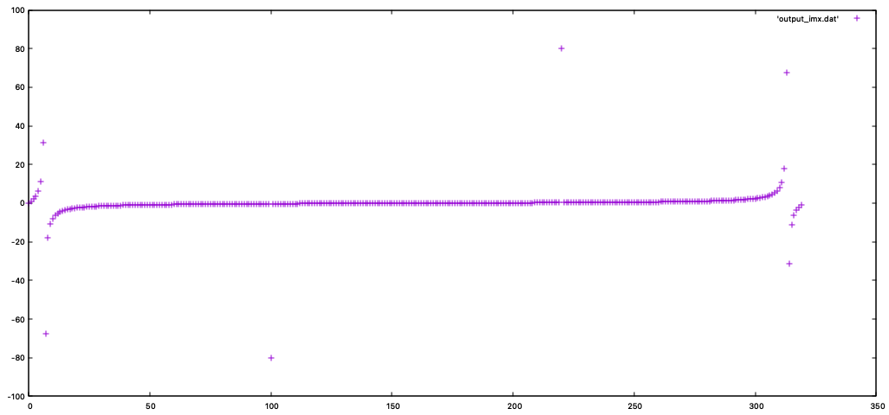
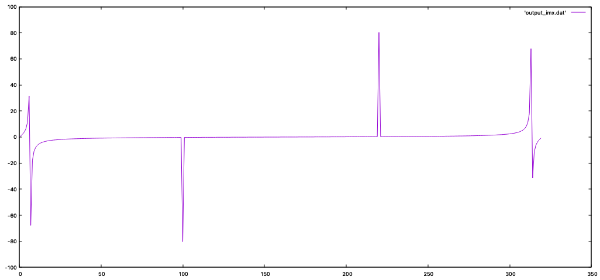
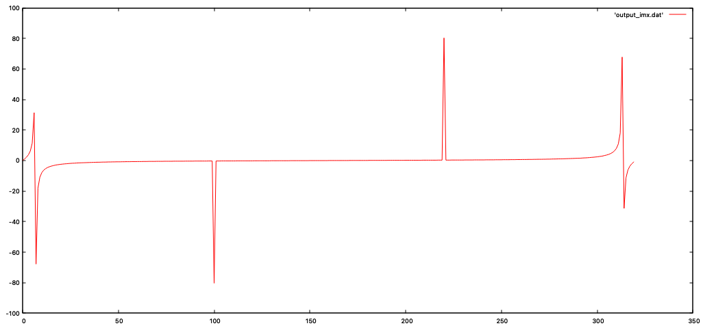
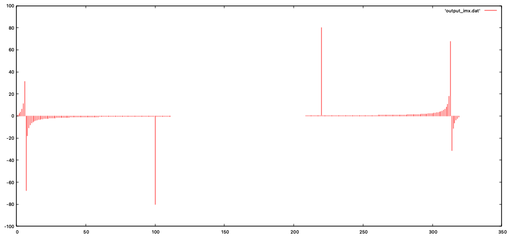

# Getting Started with Gnuplot

1) plot 'output_imx.dat'

2) plot output_imx.dat' with lines

1) plot 'output_imx.dat' with lines lc rgb 'red'

1) plot 'output_imx.dat' with impulse lc reb 'red'

   