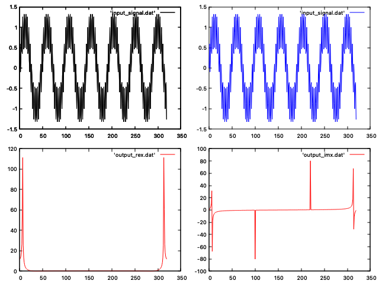

# Plotting mulitple plots with Gnuplot

1) reset
2) set size 1,1
3) set multiplot
4) set size 0.5,0.5
5) set origin 0,0.5
6) plot 'input_signal.dat' with lines lc rgb 'black'
7) set origin 0,0
8) plot 'output_rex.dat' with lines lc rgb 'red'
9) set origin 0.5,0
10) plot 'output imx.dat' with lines lc rgb 'red'
11) set origin 0.5,0.5
12) plot 'inputsignal.dat' with lines Ic rgb 'blue'

## Output
