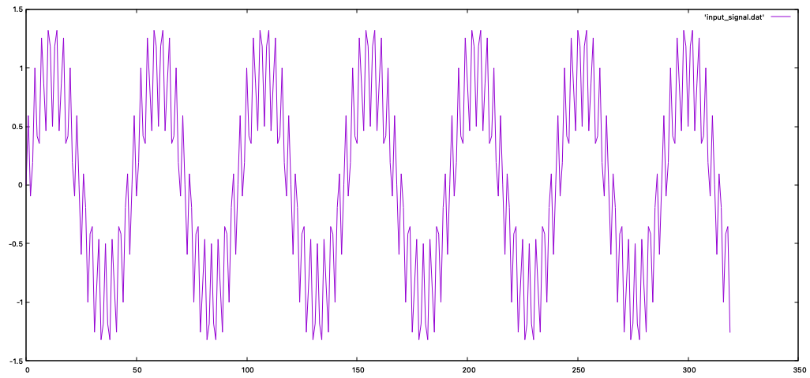

# Gnuplot Test

## How to use Gnuplot
1) Run `gnuplot`
2) Go to desire directory that contains `*.dat`
   i.e 'cd "file path"'
3) Plot *.dat file
   i.e plot "file.dat"
   i.e p "file.dat" 
4) Change output style
   i.e. plot "file.dat" with lines
 
# Default 

# Custom
